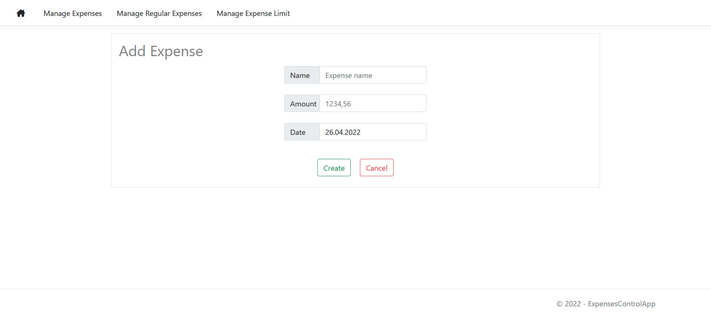

# ExpensesControlApp
This is a ASP.NET MVC web application that provides the main CRUD operations for controlling your expenses as well as other features.
## Features
- Adding, deleting and updating expenses
- Sorting expenses by name, amount and date
- All the above features for the expenses, that are repeated weekly or monthly
- Viewing expenses by different time spans (today, this week, this month, total)
- Setting up and updating an expense limit
- Visible representation of the available amount of money
- Server and client side validation
- Compatibility for all devices
## Screenshots
**Expenses page view**

**Page view for a specific time span**

**Delete partial view**

**Add page view**

**Add page validation**

**Update page view**

**Regular expenses page view**

**Regular expense update page view**

**Limit page view**

**Page views for mobile devices**

## Technologies used
- ASP.NET MVC 5
- .NET Framework 6.0
- C# 10.0
- Visual Studio 2022
- MS SQL Server 2019
- Entity Framework 6.0.3
- JQuery 3.6.0
- Bootstrap 5
- FontAwesome 4.7.0
## Acknowledgments
This project was based on ASP.NET MVC tutorial by tutorialsEU (https://www.youtube.com/watch?v=DqD-NJf7-OM)
